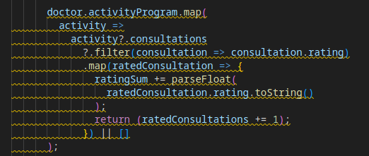
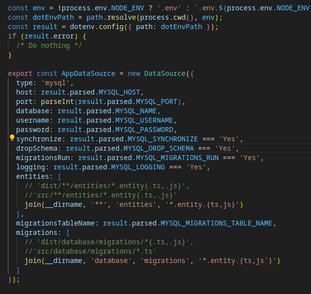
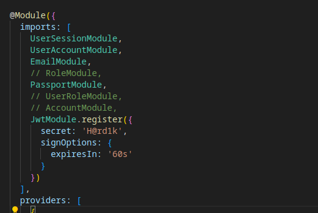
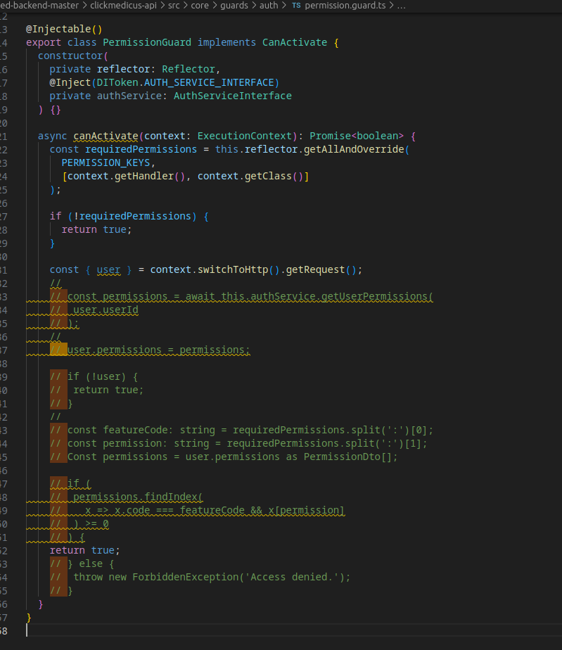
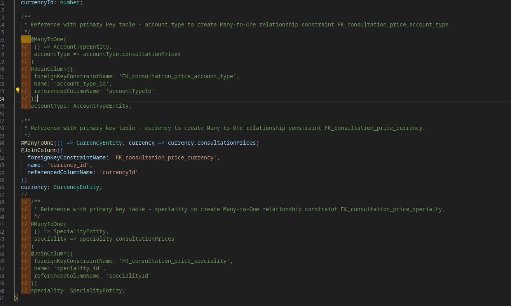
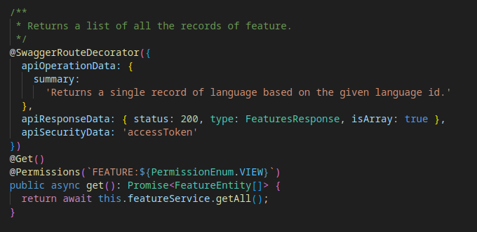
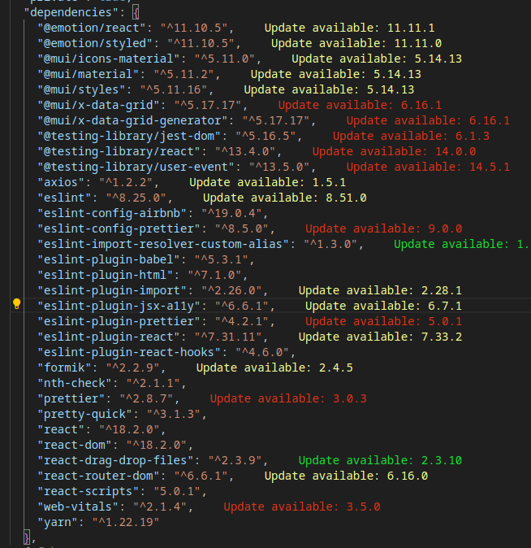
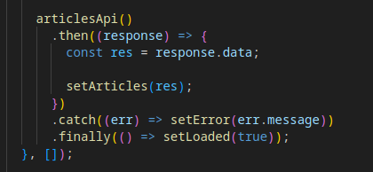

# Raport pe codul CMED

## Cuprins

- [Raport pe codul CMED](#raport-pe-codul-cmed)
  - [Cuprins](#cuprins)
  - [:door: CMED Backend Master](#door-cmed-backend-master)
  - [Baza de date](#baza-de-date)
    - [Utilizarea TypeORM](#utilizarea-typeorm)
  - [Clean code](#clean-code)
    - [Mutabilitate, Nesting si Complexitate](#mutabilitate-nesting-si-complexitate)
    - [Cod comentat](#cod-comentat)
    - [Utilizarea buclelor For pentru operații asincrone](#utilizarea-buclelor-for-pentru-operații-asincrone)
      - [Exemplu de cod refăcut](#exemplu-de-cod-refăcut)
  - [:thumbsup: Utilizarea a repository pattern](#thumbsup-utilizarea-a-repository-pattern)
  - [Docs](#docs)
    - [API Docs](#api-docs)
    - [Code Docs](#code-docs)
  - [Error handling](#error-handling)
  - [Teste](#teste)
  - [Concluzia](#concluzia)
  - [Raport Admin panel](#raport-admin-panel)
    - [Dependentele](#dependentele)
    - [File gol](#file-gol)
    - [SVG utilizat direct in component](#svg-utilizat-direct-in-component)
    - [Promises vs Async/Await](#promises-vs-asyncawait)
    - [Axios vs TanstackQuery](#axios-vs-tanstackquery)
    - [Problema de securitate: Stocarea access si refresh token in localstorage](#problema-de-securitate-stocarea-access-si-refresh-token-in-localstorage)
    - [Code smells](#code-smells)
      - [Chaining](#chaining)
      - [State](#state)
    - [Functii de Apelare API in Folderul "Services"](#functii-de-apelare-api-in-folderul-services)
    - [JavaScript vs Typescript](#javascript-vs-typescript)
    - [Concluzia](#concluzia-1)
  - [Web app](#web-app)
    - [Relative Paths](#relative-paths)
    - [Problema cu stilurile inline si duplicarea componentelor](#problema-cu-stilurile-inline-si-duplicarea-componentelor)
    - [Performanta si Alegerea Librariilor UI](#performanta-si-alegerea-librariilor-ui)
      - [Material UI si Impactul asupra Performantei](#material-ui-si-impactul-asupra-performantei)
      - [Alternative Eficiente](#alternative-eficiente)

## :door: [CMED Backend Master](cmed-backend-master)

## Baza de date

- Backend-ul utilizeaza baza de date MySQL, ati putea lua in considerare trecerea la PostgreSQL sau CockroachDB pentru o scalabilitate mai buna.
  - PostgreSQL are un model de control al concurentei, cunoscut sub numele de [MVCC](https://www.postgresql.org/docs/7.1/mvcc.html), care minimizeaza blocajele si imbunatateste performanta la citiri si scrieri, mai ales intr-un sistem cu volum mare de trafic.
  - O alta baza de date excelenta pentru scalare este CockroachDB, veti beneficia de o baza de date proiectata pentru a fi distribuita de la inceput. Acest lucru faciliteaza scalarea orizontala fara multe batai de cap.

### Utilizarea TypeORM

TypeORM este un instrument foarte bun pentru lucrul cu baze de date, in acest proiect este utilizat si script pentru generarea automata de migrari, ceea ce reduce timpul de dezvoltare.

## Clean code

### Mutabilitate, Nesting si Complexitate

Exemplu de deep nesting si cod greu de urmarit putem observa in file-ul [user account repository](./cmed-backend-master/clickmedicus-api/src/modules/user/user-account/repositories/user-account.repository.ts), de asemenea nu este urmarit principiul de imutabilitate.



### Cod comentat

Codul comentat este prezent in multe file-uri din proiect. Per general, aceste comentarii nu fac nimic decit sa aglomereze codul si sa il faca mai greu de citit. Probabil ca in unele cazuri merita lasat codul comentat, ca sa fie utilizat mai apoi, dar cel mai des aceste comentarii asa si raman.






### Utilizarea buclelor For pentru operații asincrone

In [Personal info repository](cmed-backend-master/clickmedicus-api/src/modules/user/user-account/repositories/professional-info.repository.ts) existent, metoda `updateOrCreateProfessionalExperiences` foloseste un `for-loop` pentru a gestiona actualizările asincrone. Aceasta abordare cauzeaza blocaje de performanta deoarece fiecare cerere (request) este procesata una cite una.

Utilizarea `Promise.all` permite ca toate operatiunile asincrone sa fie executate în paralel. Acest lucru imbunatateste eficienta codului si il face mai usor de citit.

#### Exemplu de cod refăcut

```typescript
updateOrCreateProfessionalExperiences = async (professionalExperiences: UpdateProfessionalExperienceDto[]) => {
    const updatePromises = professionalExperiences.map(async ({ professionalExperienceId, ...professionalExperienceValues }) => {
        
        if (professionalExperienceId) {
            return this.professionalExperienceRepository.update(
                { professionalExperienceId: professionalExperienceId },
                professionalExperienceValues
            );
        } 

            const professionalExperience = this.professionalExperienceRepository.create({
                ...professionalExperienceValues,
                startDate: professionalExperienceValues?.startDate,
                endDate: professionalExperienceValues?.endDate
            });

            return this.professionalExperienceRepository.save(professionalExperience);
    });

    const updatedProfessionalExperiences = await Promise.all(updatePromises);

    return updatedProfessionalExperiences;
};

```

## :thumbsup: Utilizarea a repository pattern

Repository pattern vine la pachet cu TypeORM, dar in acest proiect sunt create alte clase-repozitorii care sunt menite sa lucreze cu baza de date, ceea ce consider a fi o decizie buna de a separa logica de business de cea de lucru cu baza de date.

```typescript

@Injectable()
export class MedicalRecordRepository
 extends BaseAbstractRepository<MedicalRecordEntity>
 implements MedicalRecordRepositoryInterface
{
 constructor(
  @InjectRepository(MedicalRecordEntity)
  private readonly medicalRecordRepository: Repository<MedicalRecordEntity>
 ) {
  super(medicalRecordRepository);
 }

 async createEntity(data: CreateMedicalRecordDto, user: UserAccountEntity) {
  const medicalRecord = this.medicalRecordRepository.create(data);
  medicalRecord.user = user;
  await this.medicalRecordRepository.save(medicalRecord);
 }

 async updateEntity(id: number, data: UpdateMedicalRecordDto) {
  const medicalRecord = await this.medicalRecordRepository.findOne({
   where: { medicalRecordId: id }
  });

  Object.assign(medicalRecord, data);

  await this.medicalRecordRepository.save(medicalRecord);
 }

 async getEntity(id: number) {
  const medicalRecord = await this.medicalRecordRepository.findOne({
   where: { medicalRecordId: id }
  });
  if (medicalRecord) {
   return medicalRecord;
  }
 }
}

```

Totusi nu este utilizat peste tot, spre ex. [aici](cmed-backend-master/clickmedicus-api/src/modules/notifications/notification.service.ts) avem un Service in care se lucreaza cu baza de date. Service-ul per general este utilizat pentru logica de business, iar repository pentru lucru cu baza de date.

## Docs

### API Docs

Swagger este utilizat la fiecare endpoint din Controllers :thumbsup:

  

### Code Docs

Din cite am observat, entitatile au comentarii la fiecare proprietate, ceea ce ajuta dezvoltatorii sa inteleaga mai bine codul, dar uneori acestea sunt folosite redundant.

Exemplu:

:thumbsdown:

```typescript
 /**
  * Offer start date.
  */
 @Column({
  name: 'offer_start_date',
  type: 'datetime',
  comment: 'Offer start date.',
  unique: false,
  nullable: false
 })
 offerStartDate: string;
```

:thumbsup:

```typescript

 /**
  * Coins credited equivalant to amont.
  */
 @Column({
  name: 'coins_cr',
  type: 'numeric',
  comment: 'Coins credited equivalant to amont.',
  unique: false,
  precision: 18,
  scale: 2,
  nullable: false
 })
 coinsCr: number;
```

## Error handling

[GenericExceptionFilter](cmed-backend-master/clickmedicus-api/src/core/filters/generic.filter.ts) e o practica buna de a gestiona erorile intr-o aplicatie NestJS.

## Teste

Testele pe back-end lipsesc, sau daca exista sunt default generate de NestJS CLI.

Lipsa testelor pe back-end poate constitui un risc, in special pentru o aplicatie in crestere. Testele pot ajuta la identificarea problemelor inainte ca acestea sa afecteze utilizatorii.

## Concluzia

Codul per general este okay, doar cred ca are nevoie de refactoring. Daca totusi decideti sa rescrieti backend-ul pot recomanda urmatorul boilerplate [link](https://github.com/brocoders/nestjs-boilerplate/tree/main).

## Raport [Admin panel](cmed-control-panel-master)

### Dependentele

Sunt okay, dar incep sa se invecheasca.

Dependentele proiectul ar fi bine sa le mentineti utilizand [renovatebot](https://docs.renovatebot.com/) sau [dependabot](https://docs.github.com/en/code-security/dependabot)



### File gol

[Exemplu](cmed-control-panel-master/src/screens/Data/index.js)

### SVG utilizat direct in component

Per general nu e o problema, dar devine una daca acesta ocupa foarte multe linii de cod.

[Exemplu](cmed-control-panel-master/src/screens/Accounting/Login/LoginPage.js)

### Promises vs Async/Await

Async / Await este o metoda moderna si mai curata de lucru cu operatiuni asincronce comparativ cu Promises.

Exemplu: [useArticles](cmed-control-panel-master/src/services/hooks/useArticles.js)



### Axios vs [TanstackQuery](https://tanstack.com/query/latest)

Acest proiect utilizeaza Axios pentru lucru cu API, dar pentru React e recomandata utilizarea TanstackQuery, deoarece are caching, refetching, state management, optimistics update etc. fapt ce ajuta la imbunatatirea experientei utilizatorului.

### Problema de securitate: Stocarea access si refresh token in localstorage

Aceasta ar putea fi o problema de securitate, deoarece datele salvate in local storage persista dupa inchiderea tab-ului si chiar restartarea browserului, plus la astea mai exista riscul de ataca XSS.

Exemplu: [useLogin](cmed-control-panel-master/src/services/hooks/useLogin.js)

### Code smells

#### Chaining

In exemplul de mai jos avem un caz de chaining care face codul mai greu de mentinut, citit si inteles.

Exemplu: [Componenta TopBar](cmed-control-panel-master/src/screens/TopBar/TopBar.js)

```javascript
  const returnTitle = () =>
    location.pathname
      .split('/')
      .join(' ')
      .trim()
      .split(' ')
      .join(': ')
      .split('-')
      .join(' ')
      .toLowerCase()
      .replace(/\b(\w)/g, (s) => s.toUpperCase());
```

#### State

Daca avem mai multe state-uri primitive, ar fi de dorit sa fie utilizat un singur obiect.

[Componenta LeftBar](cmed-control-panel-master/src/screens/LeftBar/LeftBar.js)

Exemplu de setState:

```javascript
const [uiState, setUiState] = useState({
  openManagers: false,
  openUsers: false,
  openPosts: false,
  dataSetting: false
});

```

### Functii de Apelare API in Folderul "Services"

Faptul ca functiile de apelare a API sunt in folder-ul Services, e o practica foarte buna. Aceasta ajuta la pastrarea unei structuri / organizarea mai buna a codului.

### JavaScript vs Typescript

JavaScript e o optiune foarte buna in cazul in care timpul de dezvoltare este limitat si trebuie sa faceti cit mai multe in cit mai scurt timp, dar, daca acesta nu e cazul, atunci probabil ca ar fi bine sa incercati sa rescrieti proiectul cu TypeScript, datorita tipizarii stricte, acesta poate reduce sansele de erori si crashuri in productie.

### Concluzia

Proiectul de admin panel pare fi abia la inceput, dar fiind ca inca nu are multe componente, asa ca acesta ar putea beneficia de migrare de la JavaScript la TypeScript si de la Axios la TanstackRouter.

## [Web app](cmed-webapp-master)

### Relative Paths

Proiectul utilizeaza typescript si ar putea utiliza functionalitate de paths a acestuia.

Spre ex. aceasta importare

```typescript
import useCustomTheme from '../../../../utilities/hooks/useTheme';
```

Poate fi redusa la

```typescript
import useCustomTheme from '@utilities/hooks/useTheme';
```

Exemplu: [My Team / id](cmed-webapp-master/pages/social/my-team/team/[id].tsx)

### Problema cu stilurile inline si duplicarea componentelor

Stilurile inline sunt greu de mentinut si sunt considerate bad practice.

Se observa si copierea aceluiasi component.

Exemplu : [My team / contacts](cmed-webapp-master/pages/social/my-team/contacts.tsx)

Exemplu: [Colleagues](cmed-webapp-master/pages/social/colleagues.tsx)

```tsx
        <Stack
          width={'100%'}
          maxWidth={{ xs: '90%', md: '60%' }}
          pt={{ xs: '26px', xl: '26px', sm: '26px' }}
          direction={{ xs: 'column', md: 'row' }}
          justifyContent={'space-evenly'}
          gap={'20px'}
        >
```

### Performanta si Alegerea Librariilor UI

#### Material UI si Impactul asupra Performantei

Material UI este o librarie populara care accelereaza procesul de dezvoltare, oferind o gama larga de componente pre-fabricate. Insa, unul din dezavantaje poate fi efectul asupra performantei. Utilizarea extensiva a componentelor din Material UI poate creste dimensiunea pachetului, ceea ce poate incetini viteza de incarcare a paginii.

#### Alternative Eficiente

1. **Shadcn**: Aceasta este o librarie UI mai usoara, focalizata pe performanta, care ofera componente esentiale fara a adauga prea mult la dimensiunea finala a pachetului.
  
2. **Headless UI**: Aceasta librarie pune accent pe furnizarea de logica pentru componente, lasand dezvoltatorii sa se ocupe de stilizare. Este o optiune buna pentru cei care doresc un control total asupra aspectului, fara a sacrifica performanta.

Daca performanta si viteza de incarcare sunt aspecte critice, mai ales atunci cand vorbim de un public larg, ar fi indicat sa se considere alternative mai usoare la Material UI. Acest lucru nu doar ca va imbunatati experienta utilizatorului, dar va facilita si scalarea eficienta a aplicatiei.
